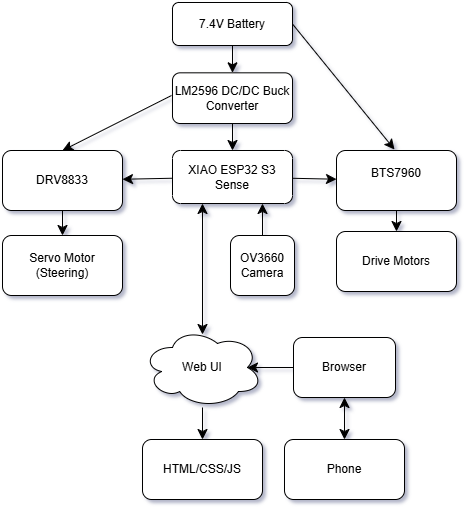
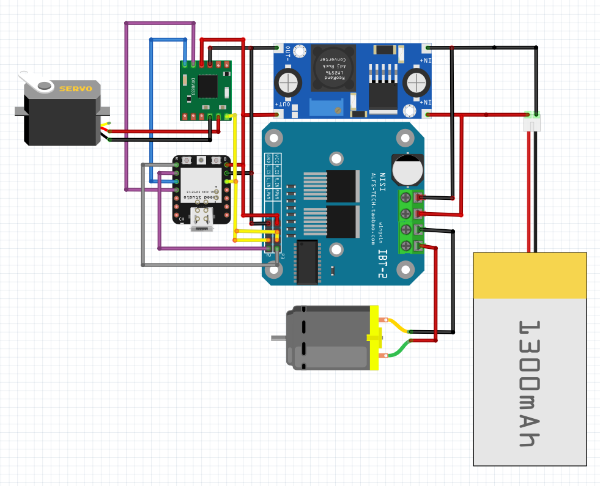

## Introduction

This project focused on the design and implementation of a **First-Person View (FPV) Remote-Controlled (RC) Car**. The primary objective was to retrofit a toy-grade RC chassiswith a modern microcontroller (**Seeed Studio XIAO ESP32S3 Sense**) to enable wireless control and real-time video streaming directly to a smartphone.

Using the ESP32-S3 SoC, I created a custom embedded web server that hosts a dual-joystick interface. This allows the user to drive the vehicle while viewing a low-latency video feed from the onboard camera, demonstrating practical applications of IoT and embedded robotics.

---

## Results and Demo

* **[Click here to watch a short video demonstration]** *([Link to your YouTube video](https://www.youtube.com/watch?v=tOG5r1Idgxo))*.

## Background and Methodology

1.  **Timers and PWM (Pulse Width Modulation):**
    - Utilized the ESP32's **LEDC peripheral** (hardware timer) to generate precision **1000 Hz** PWM signals.
    - This allowed for smooth speed control of the DC drive motors and torque management for the steering servo.
2.  **GPIO Manipulation:**
    - Configured digital I/O pins to drive the logic inputs of the H-Bridge motor drivers (BTS7960 and DRV8833).
    - Implemented "Bang-Bang" control logic for the steering mechanism by toggling GPIO states high/low based on user input.
3.  **Embedded Web Server & Concurrency:**
    - Configured the ESP32 as a **Wi-Fi Access Point (AP)** to create a standalone network.
    - Hosted an asynchronous HTTP web server to serve the HTML/JS interface and stream MJPEG video data concurrently without blocking the motor control logic.

To overcome the limitations of the toy-grade chassis and microcontroller power constraints, I implemented the following engineering solutions:

* **Hybrid Drive System:** To handle the different power requirements of the motors, I used a high-current **BTS7960** driver for the parallel-wired rear and front drive motors (handling high stall currents), while a precision **DRV8833** driver was dedicated to the steering servo.
* **Power Management:** To prevent "brownout" resets caused by high current draw, I designed a split power rail. The motors draw directly from the 7.4V battery, while the logic circuits are isolated on a regulated 5.0V rail provided by an **LM2596 Buck Converter**.
* **Latency Optimization:** The camera configuration was optimized by reducing resolution to **QVGA (320x240)** and using the `CAMERA_GRAB_LATEST` mode to discard stale frames, ensuring smooth video performance suitable for FPV driving.

---

## Block Diagram

### **System Architecture:**

### **Wiring Implementation:**

---

## Building the FPV RC Car

| Component | Description |
| :--- | :--- |
| **Microcontroller** | Seeed Studio XIAO ESP32S3 Sense (Dual Core, 240MHz) |
| **Drive Driver** | BTS7960 High-Current (43A) H-Bridge |
| **Steering Driver** | DRV8833 Dual H-Bridge Driver |
| **Motors** | 2x 390 Brushed DC Motors (Wired in Parallel) |
| **Steering** | 5-Wire Servo (Modified for DC Operation) |
| **Power** | 7.4V Li-Ion Battery (1500mAh) + LM2596 Regulator |

### **Pinout Configuration**

#### **XIAO ESP32S3 Connections**
| Pin | Function | Connection | Description |
| :--- | :--- | :--- | :--- |
| **5V** | Power Input | **LM2596 OUT+** | Regulated logic power (5.0V) |
| **GND** | Ground | **System Ground** | Common ground reference |
| **3.3V** | Logic Ref | **BTS7960 EN / DRV8833 Sleep** | Wake-up signal for drivers |
| **D0** | PWM Output | **BTS7960 RPWM** | Forward Drive Signal |
| **D1** | PWM Output | **BTS7960 LPWM** | Reverse Drive Signal |
| **D2** | Digital Out | **DRV8833 IN1** | Steer Left Signal |
| **D3** | Digital Out | **DRV8833 IN2** | Steer Right Signal |

#### **Motor Driver Wiring**
| Driver | Pin | Connection | Voltage |
| :--- | :--- | :--- | :--- |
| **BTS7960** | **B+ / B-** | **Battery Red / Black** | 7.4V (High Current) |
| **BTS7960** | **M+ / M-** | **Front & Rear Motors** | Variable PWM |
| **BTS7960** | **VCC** | **LM2596 5V** | 5.0V (Logic) |
| **DRV8833** | **VM** | **LM2596 5V** | 5.0V (Motor Power) |
| **DRV8833** | **OUT1/2** | **Servo Yellow / Brown** | Variable Polarity |

---

## Report and Presentation

* Click on **[Final Project Report](docs/Final_Project_Report.docx)** to view the report that contains additional details on system architecture and testing.

 * **[Click here to view the presentation slides] (docs/FPV RC Car Presentation.pptx)**.
